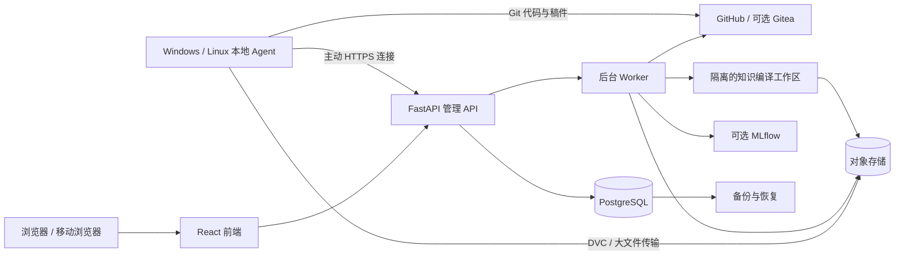

# 云端科研项目统一管理：调研与开发计划

调研日期：2026-09-18。状态：架构建议稿，尚未实施或部署。

仓库基线：`a537b81868ffe87aa10607c36c1cd472c4921a65`。目标是吸收 Ran-ASKS 的科研知识组织方法，建立跨机器、跨 Git 仓库的统一管理软件。组件选型详见 [开源组件调研](./cloud-research-components.zh-CN.md)。

## 1. 建议与范围

建议建设一个轻量的“科研项目控制中心”：云端保存项目目录、权限、版本关系、研究状态和任务记录；各台电脑继续承担编辑和计算；Git 承担代码与文本版本传输；对象存储承担大文件；知识模块保留来源追溯。

最低成本的路径是复用成熟 Web 模板与存储工具，把开发集中在四项差异化能力：项目身份、设备副本、研究版本关系、研究过程与证据的连接。

默认规划假设：个人或 2–5 人；Windows 和 Linux 优先；已有 GitHub 仓库继续使用；一台 Linux 云服务器作为管理节点；首期不在管理服务器运行大型模型或科学计算。用户尚未确认项目数量、数据规模、现有服务器与产品化目标，这些是估算前提，不是已知事实。

第一版要让用户从浏览器回答：

1. 我有哪些项目，各自在哪些机器和 GitHub 仓库？
2. 每份副本在哪个提交上，有哪些未提交、未推送或分叉的工作？
3. 离线设备最后一次报告是什么时候，哪些判断已过时？
4. 上次研究做到哪里，下一步是什么，为什么作出某项决定？
5. 某次论文投稿或实验结果使用了哪份代码、数据和环境？

## 2. 本仓库的结构与使用方式

### 2.1 已核查的结构

| 层或入口 | 当前职责 | 云端可借鉴之处 |
| --- | --- | --- |
| `AGENTS.md`、`operations/` | 请求分类、操作规范、边界与契约 | 将重要约束落实到 API 校验和任务状态机 |
| `.scripts/` | 摄入、查询、研究记忆、图操作和回归工具 | 包装稳定执行入口，逐步抽取可测试的库 |
| `dsh/` | 工具注册、guard、内存会话和 agent loop | 保留工具权限与结构化回执，持久化另由服务负责 |
| `academic/` 等四个领域 | 各自的 raw、wiki、输出及 schema | 内容类型和来源保留；首期只做科研域 |
| `cross-domain/graph.db` | 当前主图的关系、别名、证据和时态信息 | 单一权威图写入口，查询结果回溯原料 |
| `inbox/`、`temp/` | 来源接收、暂存、摄入事务和恢复 | 上传、提取、校验、发布分阶段处理 |
| `projects/<name>/` 约定 | 活跃研究文稿和代码、状态、研究记忆 | 科研工作区与已归档知识分开 |
| `academic/frontier/` 约定 | 开放问题、思路、验证和演进轨迹 | 在项目中连接问题、假设、实验和结论 |
| `paper-artifacts/` | 与论文版本绑定的冻结产物 | 发布时固定代码、数据、论文与证据版本 |

本次读取了 README、工程手册、RESEARCH/FRONTIER 规范、摄入与查询指南，以及相关 Python 精确符号；没有开展全部代码审计或真实论文摄入实验。

当前 checkout 是工程发布模板。README 明确表示运行数据默认被排除；本地也未发现 `projects/` 及 `projects/_templates/research/`。因此这里能研究已有机制，但不能据此推断用户真实项目的数量、内容或当前版本。初始化脚本依赖该模板目录，直接调用会因模板缺失而失败。

证据：[README](../README.zh-CN.md)、[工程手册](../operations/engineering/engineering-handbook.md)、[研究规范](../operations/RESEARCH.md)、[Frontier 规范](../operations/FRONTIER.md)、[项目初始化代码](../.scripts/research_project.py)。

### 2.2 当前使用路径

用户提出需求 → `playbook_dispatch.py` 查既有流程 → `route.py` 分发当前任务的规范 → 工具执行 → 校验后交付。

典型入口包括：

```text
规则导航：route.py --task query --query-stage start
论文摄入：ingest_paper.py --pdf inbox/<file>.pdf
恢复摄入：ingest_paper.py --resume <txn-id>
查询工具：wg.py lookup / neighbors / read-section / read-raw
研究接续：research_memory.py recall <project>
研究记忆：wg.py recall / remember
开放问题：wg.py frontier ...
工程修改：engineering_graph.py impact <target> --verify
```

这些是仓库现有入口示意，不是新云平台已经提供的命令。论文摄入包含提取、书目确认、知识编译、校验、落位、图写入和收尾。事实回答必须返回 raw 的具体证据位置；wiki 和图主要负责组织与导航。研究记忆、草稿和 Frontier 不应自动升级为事实来源。

证据：[代码调用指南](../operations/engineering/code-guidance.md)、[统一工具入口](../.scripts/wg.py)、[项目宪法](../AGENTS.md)。

### 2.3 可复用机制与改造边界

| 本仓库机制 | 建议处理 | 原因 |
| --- | --- | --- |
| raw → wiki → 图 → raw 核验 | 保留概念，设计版本化来源地址 | 可追溯是科研使用的基础 |
| 确定性编排、语义槽、提交前校验 | 保留 | 控制 LLM 成本并约束输出 |
| 摄入断点、事务标识、质量状态 | 包装为后台 job | Web 请求不应等待整篇论文处理 |
| `status.md` + 结构化研究记忆 | 保留双层用途，统一写入协议 | 前者回答当前位置，后者保存决策历史 |
| Frontier 与事实图分离 | 保留 | 假设和验证结果必须有明确状态 |
| 本地路径作为节点身份 | 增加全局 ID 与旧 locator 映射 | 跨机器路径、重命名和多项目会冲突 |
| DSH 内存 session log | 不充当云端数据库 | durable job、审计、事件需要独立持久化 |
| SQLite 图及固定根目录 | 首期隔离运行，按需迁移 | 简单地并发调用脚本不等于多用户服务 |

具体代码证据：`research_memory.py` 的 `next_mem_id()` 从本地索引取最大编号，`save_index()` 整体覆盖索引；多台机器会竞争同一编号或覆盖内容。云端使用 UUID、追加记录和数据库唯一约束，导入时保留旧编号映射。

`graph_lib.py` 的 `graph_db_for()` 按路径分主库/private 库，`connect()` 同时包含建表/迁移行为；服务化后应把迁移放在启动或显式迁移阶段，并单独提供只读查询连接。迁移前仍严格使用当前脚本入口，不对本仓库数据库裸查或直写。

`wg.py` 的 `envelope()` 即使输出 `ok=false` 也返回 0。适配器必须检查 JSON 的 `ok/status/error`，不能只以进程退出码判定成功。`dsh/ingest_tools.py` 直接调用 `python3` 和仓库 cwd，需要显式解释器、工作区根路径及进程资源限制。

代码证据：[研究记忆](../.scripts/research_memory.py)、[图基础库](../.scripts/graph_lib.py)、[wg 回执](../.scripts/wg.py)、[DSH 摄入工具](../dsh/ingest_tools.py)。

### 2.4 许可证影响复用方式

本仓库采用 PolyForm Noncommercial 1.0.0；README 明确不授予商业使用权，商业使用需作者另行书面许可。冻结数据还有独立许可。建议在新仓库开发云端核心，保留原仓库作为有版本标识的参考或非商业可选适配器；不要把其源文件直接搬入一个宣称全 MIT/Apache 的产品。

若未来产品化，先明确原代码的使用许可与归属，再决定保留适配器还是独立实现相应接口。进程隔离本身不会消除许可证要求。来源：[本地 LICENSE](../LICENSE)、[README 许可证说明](../README.zh-CN.md#许可证)。

## 3. 功能划分与优先级

| 优先级 | 功能 | 用户看到的结果 | 验收要求 |
| --- | --- | --- | --- |
| P0 | 项目目录与身份 | 一个项目汇总多个 repo、目录和设备 | 显式绑定；同名文件夹不自动合并 |
| P0 | 本地 Agent | 选定目录登记、心跳、Git 状态和离线队列 | Windows/Linux 可用，离线不阻塞编辑 |
| P0 | GitHub 连接 | 仓库、分支、提交、PR 的统一入口 | 最小权限；断连和限流可见 |
| P0 | 版本对比 | 同步、领先、落后、分叉、未知及 dirty 标记 | 对共同历史可证明；历史不足返回未知 |
| P0 | 研究接续 | 当前状态、下一步、决策与笔记 | 有修订历史和并发冲突提示 |
| P0 | 可恢复同步 | 查看计划后执行 push/fetch/新目录恢复 | 不覆盖未提交工作；重复操作幂等 |
| P0 | 基础权限与备份 | 私有项目、设备撤销、可恢复副本 | 越权测试及一次空机恢复通过 |
| P1 | 大文件版本 | 数据、结果、图表与 Git 版本关联 | DVC 按需下载，校验数据完整性 |
| P1 | 知识与来源 | 文献、知识页面、证据定位和检索 | 每个事实回答可打开具体原件版本 |
| P1 | 问题与研究轨迹 | 假设、验证计划、结果、遗留问题 | 假设不会混入已验证结论 |
| P1 | 实验与投稿快照 | 代码、数据、环境、结果和稿件一起冻结 | 新机器可恢复；复现有具体环境前提 |
| P2 | 远程执行 | 在指定工作站运行固定任务模板 | 身份、资源、日志、取消、结果齐全 |
| P2 | 团队协作 | 项目角色、评审与通知 | 服务端逐项授权，含搜索与附件 |
| P2 | 高级科研工作台 | Notebook、计算调度、协同编辑等插件 | 有实际需求再接入 |

首期不开发自有 Git 服务、通用网盘、桌面编辑器、实时多人文档算法和通用 AI 编排平台。后续扩展应能说明减少哪项实际工作。

## 4. 架构建议

### 4.1 前后端、本地与云端的责任



前端：React + TypeScript + Vite，沿用模板的组件库、表单和生成 API 客户端。后端：FastAPI + PostgreSQL，按项目、设备、版本、知识、任务五个模块组织；先做模块化单体。

基础选用 [Full Stack FastAPI Template](https://github.com/fastapi/full-stack-fastapi-template)。其现版已包含 React、Python API、PostgreSQL、认证与测试，支持 Compose 自托管。现版生产默认由 FastAPI 同域提供前端静态文件；若要求独立前端容器，需要调整构建和反向代理，不能把“代码分层”误说成已完成部署分离。

建议我们的部署将前端与 API 独立构建，经同一 HTTPS 域名路由：`/` 指向前端，`/api/v1` 指向 API。这样保持清晰接口，也减少跨域配置。本地科研代码、编辑器和运算不依赖 Web 界面持续在线。

本地 Agent 首期用 Python CLI + 后台服务，复用系统 Git；协议稳定后再评估 Go 单二进制分发。Agent 仅扫描用户登记的根目录，状态记录放在用户配置目录中的 SQLite，不在每个研究目录制造运行垃圾。浏览器不能直接获取任意本地文件，本地操作由经过配对的 Agent 处理。

### 4.2 数据权威与写入责任

| 数据 | 权威位置 | 云端管理方式 |
| --- | --- | --- |
| 项目 ID、repo 绑定、设备、权限 | PostgreSQL | 唯一业务写入口 |
| 代码、LaTeX、Markdown 稿件 | 各项目指定的 Git 上游与提交历史 | 保存 repo ID、SHA、ref 和观察时间 |
| 本地未提交文件 | 对应本地工作区 | 默认只上报状态；明确创建 checkpoint 才上传内容 |
| 大型数据和结果 | 对象存储中的不可变内容 + Git 内 DVC 指针 | 按哈希和 manifest 关联 |
| 已摄入原件 | 版本化对象或原仓库 raw | 原件只增不改，提取结果另存 |
| 云端研究状态和新增记忆 | PostgreSQL 修订/追加记录 | Markdown 为导出或离线缓存；写回走带基线版本的 API |
| 已有项目 `status.md` | 由接入时选定的模式决定 | `git_file` 模式只读索引；迁移到 `managed` 后由服务统一写，禁止隐式双主 |
| 原 ASKS 图边 | 隔离工作区的 `graph.db` | 沿用原脚本操作，仅提供只读视图 |
| 新系统知识关系 | 未来显式迁移后的 PostgreSQL 边与证据表 | 迁移验收后切换权威，不与旧库双写 |
| 搜索索引、向量、缓存 | 可重建 | 携带 source version、编译器版本及权限范围 |

知识图是从来源编译得到的，但其中当前维护的边、别名和出处属于应备份的运行主状态，不能假设仅凭 wiki 就能无损重建。迁移时同时保留原件、wiki、图数据库、manifest 与映射表。

### 4.3 关键对象和 API 草案

项目与仓库不是一对一。一个科研项目可能包含论文仓库、算法仓库和数据集；一个仓库也可能支撑多个项目。

| 对象 | 最少字段 |
| --- | --- |
| Project | UUID、name、stage、owner、workspace_id、revision |
| Repository / ProjectRepository | provider、provider_repo_id、URL aliases、项目中的角色、指定上游 |
| Device | UUID、名称、OS、最近心跳、协议版本、撤销状态 |
| WorkingCopy | UUID、project/repo/device ID、本地路径、分支、HEAD、dirty、观察序号 |
| Observation | copy_id、seq、observed_at、server_received_at、refs、工作区状态 |
| Checkpoint | UUID、代码 SHA 列表、可选 patch/未跟踪文件 manifest、来源设备 |
| DatasetVersion / Artifact | 哈希、大小、存储引用、校验状态、访问范围 |
| ResearchEntry / Question | UUID、类型、修订、证据引用、科学状态、作者 |
| SourceVersion / Evidence | 原件版本、哈希、页码/锚点、提取器版本 |
| ReleaseSnapshot | repo 提交、数据 manifest、环境锁文件、稿件和结果清单 |
| Job / AuditEvent | 类型、输入指纹、幂等键、状态、actor、设备、回执 |

示意 API：

```text
POST /api/v1/devices/pair
POST /api/v1/devices/{id}/observations
POST /api/v1/projects/{id}/bindings
GET  /api/v1/projects/{id}/copies
GET  /api/v1/projects/{id}/comparison
POST /api/v1/projects/{id}/checkpoints
POST /api/v1/projects/{id}/sync-plans
POST /api/v1/sync-plans/{id}/execute
PUT  /api/v1/projects/{id}/status  (If-Match: revision)
POST /api/v1/projects/{id}/entries
POST /api/v1/uploads
POST /api/v1/ingestions
GET  /api/v1/jobs/{id}
GET  /api/v1/sources/{id}/versions/{version}/evidence
POST /api/v1/projects/{id}/releases
```

接口需使用结构化 schema、游标分页、幂等键、修订检查。`comparison` 必须返回基准 ref、观察时间、Git 图证据是否完整；接口名称不代表全部进入第一版。

### 4.4 页面草案

导航首期控制在“项目、设备、任务、设置”。项目详情包含概览、副本与版本、研究记录；知识、数据与实验在相应阶段打开。

概览卡显示阶段、下一步和未解决问题；副本表显示设备/路径、分支、HEAD、未提交数、与指定上游的关系、最后联机时间；异常提示提供“查看差异”“创建 checkpoint”“恢复到新目录”等具体动作。

AI 入口放在项目语境内。它可以整理进展、解释版本差异、查证文献；不能把生成的建议自动视为已执行的版本合并。

## 5. 多机器和多版本的处理规则

### 5.1 项目识别

Agent 提供候选，用户确认绑定。证据强度依次为：已有全局项目 ID、已绑定的 provider repo ID、归一化 remote URL 与共同 Git 历史、内容哈希相似度。最后一种仅用于推荐。

不同 GitHub fork、同名目录和旧压缩包不能仅因名字相近就合并。明确的独立研究分支保存为 branch/fork；仅目录复制且没有 Git 历史的版本先分别建 manifest，作为候选副本导入。

### 5.2 版本关系

对指定基准提交 A 与副本提交 B，使用原生 Git 的共同祖先和可达性判断：相同、仅 B 领先、仅 B 落后、双方分叉。Git 文档提供 [rev-list](https://git-scm.com/docs/git-rev-list) 和 [merge-base](https://git-scm.com/docs/git-merge-base) 的相应能力。

HEAD 哈希本身不足以比较两个不在同一对象库里的历史。云端维护受控 bare cache，或由拥有完整历史的本地 Agent 计算；缺对象、浅克隆、无权限或取回失败时返回 `unknown/incomplete_history`。没有共同祖先时返回 `unrelated`，不得自动执行允许无关历史合并。

dirty 状态独立于提交关系：HEAD 相同也可能有不同的未提交修改。不得按照文件修改时间选择“最新版本”，也不得将一台长期离线设备显示为当前同步。

### 5.3 同步与冲突

1. 观察：只读扫描工作区状态。需要 fetch 时作为显式 Git 操作执行；离线只保留最后观察。
2. 计划：生成操作列表，说明目标设备、路径、基线 SHA、文件变更和冲突。
3. 执行前重验：检查 HEAD、dirty、路径、token 和基线；变化则使旧计划失效。
4. 执行：复用 Git/DVC，记录结构化结果。云端编辑稿件进入分支或 PR；从服务器恢复默认 clone 到新目录。
5. 冲突：代码/文本保留两侧并展示差异，二进制保存独立版本。正常动作不做 force push、reset --hard 或自动清理未跟踪文件。

未提交修改可创建独立 checkpoint：记录 index/工作树差异、经筛选的未跟踪文件、基线提交及内容清单。它不会被假装成已推送 Git commit；大文件另走对象存储，默认排除凭据、缓存和环境目录。

两个 Git 主站之间不设置自动双向镜像。每个 repo 明确一个主要写入上游，其他位置作为镜像或有独立身份的 fork。

### 5.4 断网与可靠传输

本地 outbox 使用 `(device_id, event_id)` 去重，WorkingCopy 的单调序号防止乱序覆盖；时钟只供展示，不承担事件排序。心跳和状态上报可自动运行，上传文件与执行写操作按配置策略进行。

大文件采用组件已有的分块/重试能力，校验成功后才发布 manifest。任务采用至少一次投递加业务幂等，失败重试不重复创建记录或重复摄入；不承诺分布式“恰好一次”。

Syncthing 可用于独立的资料投递箱，但不用于同步 `.git/`、运行中的 SQLite、DSH 会话或整个活跃研究工作树。它不能代替 Git 的历史语义与本系统的冲突决策。

## 6. 科研知识与实验的连接

知识模块采用“原件版本 → 提取版本 → 知识页面修订 → 关系/索引”的链路，原件哈希、提取器版本、编译提示版本、模型、来源 locator 和任务 ID 一起记录。模型升级后能选择重编译，原件和人工修订历史保留。

导入 ASKS 时先只读展示已有内容；复用摄入时按独立知识库工作区串行写图，并由原入口完成验证。新建云端多租户知识引擎或 SQLite→PostgreSQL 迁移属于后续独立工程，需映射 nodes、aliases、edges、edge_evidence、origins、temporal_facts 和旧路径，验证边数、出处可达性与代表查询后才能切换。

搜索先做项目名、文件名、标题、关键词与结构过滤；中文分词和混合检索需专门验收。语义检索按需要加入 [pgvector](https://github.com/pgvector/pgvector)，权限过滤贯穿检索、重排、引用和下载。全局公开索引与私有内容不混用缓存。

文献优先连接 [Zotero API](https://www.zotero.org/support/dev/web_api/v3/basics)，保存 library/item/version 标识；首期只读，不重建整套文献客户端。PDF 可评估 [Docling](https://github.com/docling-project/docling)，用真实物理论文对公式、多栏和表格质量作小样比较，不预设替换现有提取器。

大型数据默认评估 [DVC](https://github.com/treeverse/dvc)，实验指标和产物按需求接入 [MLflow](https://github.com/mlflow/mlflow)。MLflow 可作为运行记录服务，但通用理论研究的问题、推导和论证仍由项目研究记录承载。

一次可复现的发布快照至少关联：代码 SHA、数据 hash/manifest、环境锁文件或容器 digest、命令与参数、随机种子、关键硬件/驱动、结果文件、稿件版本和来源引用。记录齐全并不保证数值逐位一致；验收应按具体领域定义允许误差。

## 7. 部署、权限与成本控制

### 7.1 最小部署

首期采用单台 Linux + Docker Compose：反向代理、前端、API、PostgreSQL、Worker。API 和 Worker 共享业务代码但独立进程。后台任务优先验证 [Procrastinate](https://github.com/procrastinate-org/procrastinate) 的 PostgreSQL 队列以减少额外服务；其维护者招募状态列入选型风险，PoC 不通过再替换队列适配器。

对象存储先使用已有服务；要求全部自托管时评估 SeaweedFS 的 S3 接口。Gitea、MLflow、知识编译器都按需启用。初期无需 Kubernetes、独立图数据库、独立向量数据库或独立搜索集群。

建议性能试验起点为 2 vCPU/4 GB、少量并发任务；较完整的 2–5 人试点可从 4 vCPU/8 GB 测试。以上是规划资源，不是已测容量；PDF OCR、模型和大规模科学计算另放工作站/计算节点。

### 7.2 与需求直接相关的权限边界

- 本地 Agent 主动通过 HTTPS 连接云端；通常无需打开个人电脑入站端口。
- 设备配对有短期码、独立凭据与撤销；只允许在登记根路径执行固定动作，处理路径穿越和符号链接越界。
- GitHub 首选限定仓库的 GitHub App；token 留在后端或设备凭据管理器，不写入项目配置、日志和前端。官方支持按安装、仓库和权限限制令牌：[GitHub App API](https://docs.github.com/en/rest/apps/apps)。
- 初期只支持单人账户也要落实项目归属检查；加入成员时再扩展角色，不把模板登录功能当作完整项目授权。
- 上传、对象下载、搜索与 AI 上下文统一遵守项目权限。Private 数据沿用明确隔离边界。
- 编译器/未来科研任务不与 API 共用不受限执行权限，不把任意 shell 字符串作为远程管理 API。

### 7.3 备份与成本

[restic](https://github.com/restic/restic) 用于加密增量备份。PostgreSQL 先生成一致性备份；SQLite 使用安全快照或暂停写入；Git cache、对象存储、知识原件、图与配置纳入同一份恢复 manifest。对象数据和数据库分时备份时，以 manifest 校验引用完整性。

必须在独立机器演练恢复。初期可设目标 RPO 24 小时、管理服务 RTO 4 小时；这只是拟定服务目标，大型数据回迁时间另算。同步删除与上游损坏会传播，因此同步不能替代独立备份。

月成本应拆为：服务器 + 主存储 + 异地备份 + 请求/出站流量 + 模型调用 + 运维时间。本次没有云地域、容量和流量参数，未声称提供实时报价。

最重要的节省方式：先同步元数据、按需拉取大文件、哈希去重、重复摄入跳过模型、控制索引范围、只启用实际需要的服务。部署于国内或海外需结合用户机器连接、GitHub 可达性与资料存放要求实测后选址。

## 8. 实施路线与验收

以下按一名熟悉 Python/React 的开发者估算，含正常集成和验证；属于工程估算而非承诺。阶段有依赖，AI 辅助不消除跨端与数据恢复测试。

| 阶段 | 估算 | 交付 | 放行条件 |
| --- | --- | --- | --- |
| A：样本与技术验证 | 3–5 工作日 | 选 3 类代表项目；盘点 2 台设备；模板、Git 比较、DVC 小样 | 能区分副本/分叉；明确网络和许可边界 |
| B：只读项目总览 | 10–15 工作日 | 登录、项目/设备/副本、Agent、GitHub 只读连接、版本比较 UI | 两台机器与 GitHub 在一个项目页可见，离线/dirty/未知正确 |
| C：可恢复的工作闭环 | 10–15 工作日 | 研究状态/记忆、checkpoint、同步计划、冲突处理、备份恢复 | 数据不被静默覆盖；新目录恢复与断网重试通过 |
| D：科研知识与数据 | 10–20 工作日 | Zotero、DVC、知识来源链、Frontier、可选 MLflow | 原件可追溯，快照可恢复，关键论文小样质量达标 |
| E：远程执行与协作 | 10–20 工作日 | 固定任务模板、团队角色、计算节点/Notebook 按需接入 | 权限隔离、取消、日志和结果回收通过 |

A–C 约 23–35 工作日，即 5–7 周全职开发，得到实用 MVP；D 后约 7–11 周；加入 E 后约 9–15 周。若只有一名研究者兼职，按有效投入工时换算；若把无 Git 历史的旧目录自动归并、多人协同编辑或多租户商业化列入首期，应重新估算。

### 8.1 首个开发迭代的工作项

| ID | 工作项 | 依赖 | 完成定义 |
| --- | --- | --- | --- |
| A01 | 真实项目清单与数据分类 | 用户选样本 | 明确设备、repo、无 Git 目录、隐私、大文件 |
| A02 | 新应用仓库与模板锁定 | 复用方案确定 | 上游 commit、许可、依赖锁和 Compose 可重建 |
| A03 | Project/Repo/Device/WorkingCopy 模型 | A01 | 唯一约束、映射与迁移通过 |
| A04 | Windows/Linux 只读扫描器 | A03 协议 | Git 状态、worktree、中文路径、离线均可处理 |
| A05 | 项目副本表与详情 | A03 | 观察时间与 dirty 可见，不显示虚假同步 |
| A06 | GitHub 只读适配器 | A02/A03 | 仓库限定、分页、限流、凭据撤销可用 |
| A07 | Git 比较服务 | A04/A06 | 同步/领先/落后/分叉/无关/不完整历史均有用例 |
| A08 | 端到端演示 | A05/A07 | 一项目、两台设备、一 GitHub repo 的完整演示 |

建议首先验证 A04+A07 的闭环：它直接覆盖当前最痛的问题，也能尽早发现路径、凭据、浅克隆和旧副本带来的真实复杂度。

### 8.2 必须验证的故障情形

| 场景 | 预期行为 |
| --- | --- |
| 两台机器同一 SHA，但都有不同未提交改动 | 分别显示 dirty；不得宣称内容一致 |
| 两台机器同时改同一稿件 | 保留双方历史；旧计划过期或产生冲突 |
| offline → 重连重复上报 | 去重并按序更新，不回退状态 |
| 队列重复执行、Worker 上传后崩溃 | 重试后不重复发布，只提交完整 manifest |
| 同名不同研究项目、不同 fork | 只推荐绑定，不自动合并 |
| shallow clone / 目标 SHA 不在 cache | 显示 unknown 并说明原因 |
| 无 Git 目录、detached HEAD、submodule/worktree | 明确支持状态；无法处理时不改动目录 |
| 文件大小写碰撞、中文名、长路径、symlink | 给出可操作错误，不部分覆盖 |
| 设备 token 撤销或 GitHub 权限收回 | 停止访问，记录连接失效 |
| 用户访问他人项目的搜索/附件/来源 URL | 服务端拒绝；无缓存串漏 |
| 工具退出 0 但 JSON 为错误 | job 进入失败或人工处理状态 |
| 从空数据库和空缓存恢复 | 项目映射、历史、对象和来源链校验通过 |

## 9. 迁移现有分散项目的方法

1. 在选定机器运行只读盘点，收集目录、Git remote、refs、状态、文件类别与体量；初始不上传正文和数据。
2. 展示候选归组，由用户确认项目绑定、独立 fork、主要上游与归档副本。
3. 为每份唯一副本保留基线 manifest；Git 数据用保留 refs 的方式备份，未提交改动另外保存。
4. 先接入三个项目：正常 Git 项目、带大文件的计算项目、没有 Git 历史的旧目录项目。
5. 运行一至两周日常流程，核对版本关系、离线状态与恢复成功率，再扩到其余项目。
6. 知识数据作为独立导入：原件保持不变，旧路径映射为版本化 source ID；原有来源链必须可回查。

退出或更换系统时应能导出：项目映射 JSON、Git 原生仓库、Markdown 研究记录、DVC manifest、对象文件及校验和、关系与证据清单。云服务不可用时，本地代码和稿件仍可继续工作。

## 10. 本轮调研验证与待决事项

已执行：playbook 查询、build 路由、工程影响卡、DSH 建设读取门、定向文档/符号读取、`wg.py --help`、工程元图校验。元图返回有效：163 节点、237 边、11 能力包、4 契约。没有运行全套回归、真实摄入、跨设备同步或组件集成测试。

运行环境最初缺 PyYAML，已仅安装到 `temp/cloud-research-deps/` 供本次读取使用。Windows DSH 子进程读取曾遇到 GBK/UTF-8 解码失败，通过本次命令的 `PYTHONUTF8=1` 解决；云化时需将编码和解释器策略纳入跨平台适配。

本轮只新增调研文档，未修改现有运行规则、DSH 组件、raw、wiki 或 graph.db。工程图仍描述现有系统，不提前登记未实现的云组件。

后续最影响取舍的输入：使用人数；Windows/Linux/macOS 比例；Git 管理覆盖率；最大文件与总数据量；服务器所在地域和资源；是否需要科研远程执行；是否计划商业化。当前方案可在这些信息补齐前开展只读盘点与样本验证。
